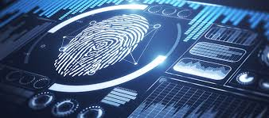
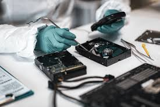

<h1 align="center">Intro Digital Forensics 🕵️</h1>

  
  

 

> ### 🕵️Forensic  
 is the application of science to investigate crimes and establish facts. 
> ### 👩‍💻digital forensics
 is branch of forensics science  that envolves investigation, recovering, analyzing and examinating digital evidence from various devices that can store digital data.

> ### What should you do as a digital forensic investigator?

After getting the proper legal authorization, the basic plan goes as follows:
- Collect the evidence.
- Place the evidence in a secure container(isolate them from the network).
- Transport the evidence to your digital lab. 

  

 

At the lab, the process goes as follows:
- Create a forensic copy from the evidence(use a advanced software to avoid modifying the original data).
- Return the digital evidence to the secure container.
- Start processing the copy on your forensic workstation.(use hash value for confirm that a file has not been modified).
- Reporting 

⛓️ Chain of custody (chronological documentation )(it help to establish the continuity and reliability of the evidence)
